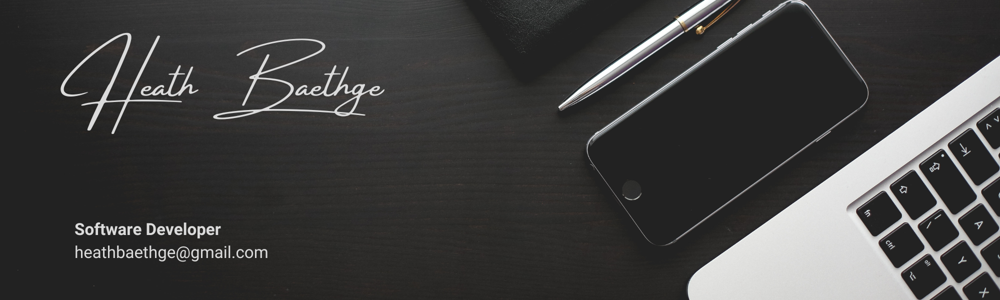

### Hi there 👋

<!--
**HeathBaethge/HeathBaethge** is a ✨ _special_ ✨ repository because its `README.md` (this file) appears on your GitHub profile.

Here are some ideas to get you started:
-->

- 🔭 I’m currently working on learning new methods to improve and make my code more efficient.
- 🌱 I’m currently learning Python
- 👯 I’m looking to collaborate on anything that helps me learn new things.
- 🤔 I’m looking for help with resources or materials to learn advanced coding practices.
- 💬 Ask me about anything.  Even if I don't know about a topic, I'm willing to learn and discuss.
- 📫 How to reach me: [LinkedIn](https://www.linkedin.com/in/heath-baethge)
- 😄 Pronouns: He/Him
- ⚡ Fun facts: I'm left handed, I love anything to do with art, and I love puzzles.

>“It is only when we take chances, when our lives improve. The initial and the most difficult risk that we need to take is to become honest." — Walter Anderson
